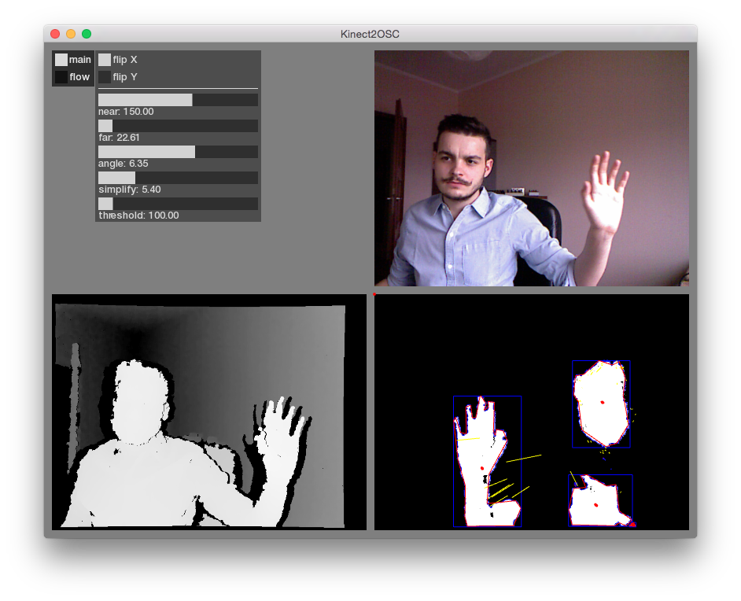

# Kinect2OSC

## There's experimental processing-based version in branch `processing`.

Kinect2OSC is simple openFrameworks applications for sending some pre-prepared data from Microsoft Kinect using OSC.

Messages include recognized blob contours, centroids, and Lucas-Kanade optical flow data.

## Installation

You can try and build this application yourself, it requires openFrameworks and some external addons: ofxCv, ofxUI, ofxOsc.

There's also binary available in [releases](https://github.com/szymonkaliski/Kinect2OSC/releases) section.

## OSC Messages

* `/count` - sends number of recognized blobs/centroids
* `/centroid/n` - sends two float values - `x` and `y` position of centroid `n`
* `/blob/n` - sends set of values describing blob contours of blob `n` - `x1`, `y1`, `x2`, `y2`...
* `/flow` - sends set of values describing optical flow in the image - `x1`, `y1`, `x2`, `y2`...

## NPM Module

There's counterpart to this application - [kinect2osc-receiver](https://github.com/szymonkaliski/kinect2osc-receiver) - released as npm module (currently available only from github), for easy interfacing with node.js/Plask applications.
